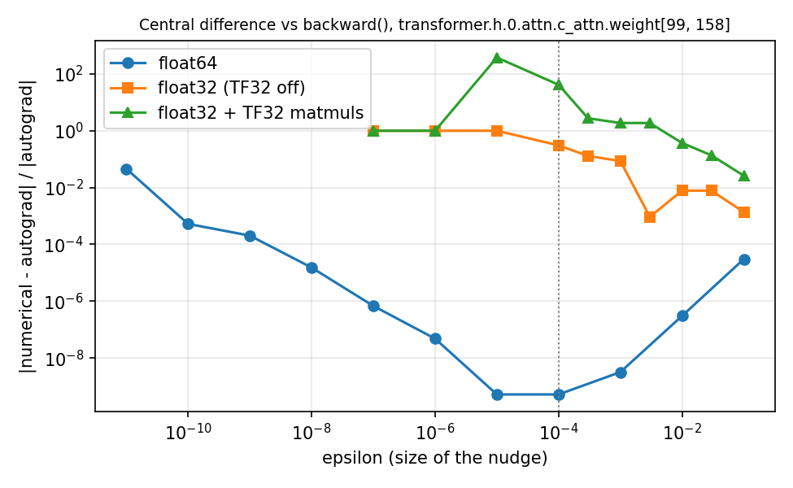
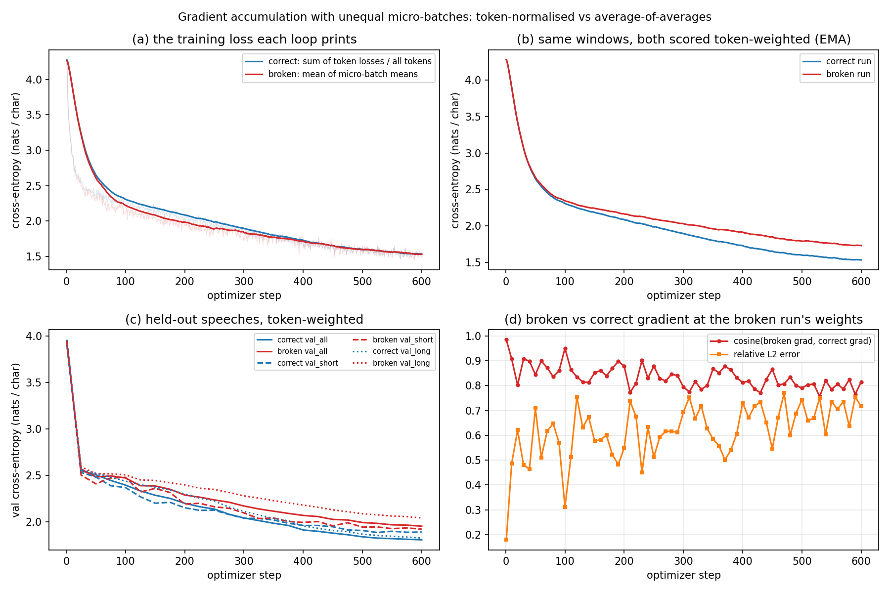
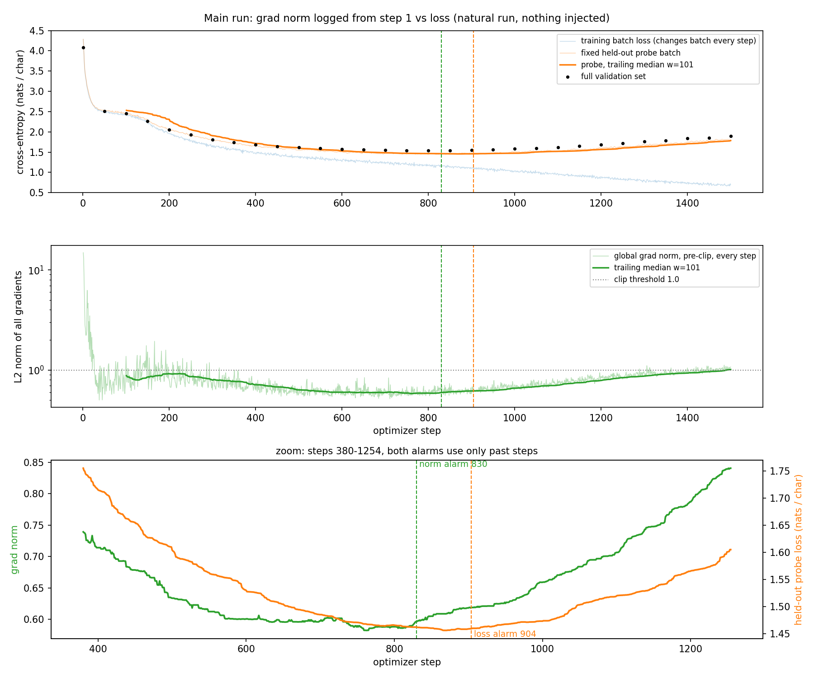
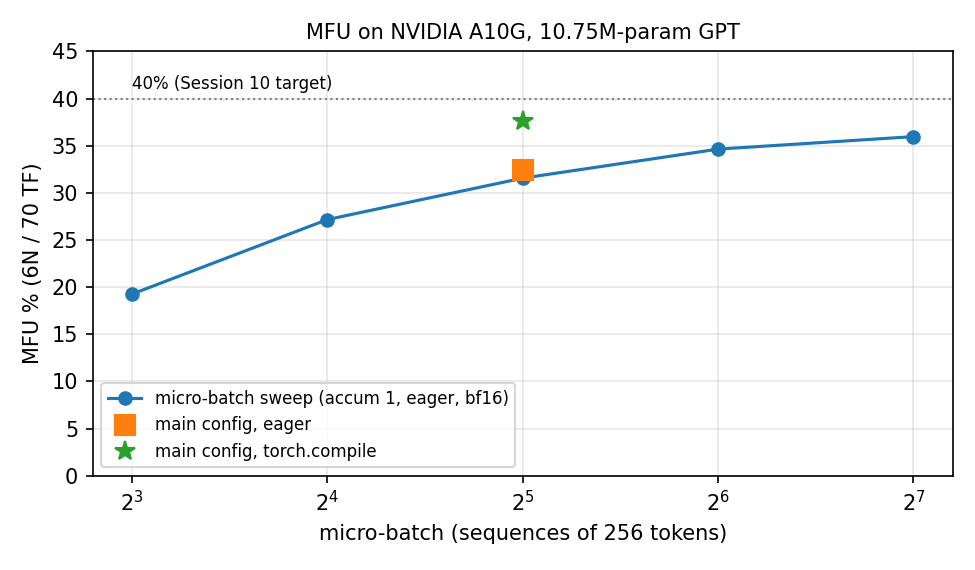

# A small GPT that has to tell the truth about its own training loop

Built as ERA V5 Session 10 assignment.

I trained a 10.7M-parameter nanoGPT-style character model on Tiny Shakespeare on one Modal A10G. Then I opened it up:
I traced one step through every layer, nudged a single weight by hand, broke gradient accumulation on purpose, watched the grad norm from step 1,
timed the loop for MFU and worked out the bits of 0.1.

Everything below comes from one top-to-bottom execution of [`training_loop.ipynb`](training_loop.ipynb).
That run made 100 `check(...)` assertions and all of them passed. The raw numbers are in [`artifacts/`](artifacts) and the plots in [`figures/`](figures).

| Question | Headline result | Notebook section | Evidence |
|---|---|---|---|
| Every tensor shape, with meanings | 135 traced tensors, each checked against its symbolic shape | 1 | `tensor_trace.csv`, `layer_audit.csv`, `param_audit.csv` |
| One gradient by hand | `h.0.attn.c_attn.weight[99,158]`: numerical -1.826167128627e-03 vs autograd -1.826167129583e-03 (rel. err 5.2e-10) | 2 | `gradcheck.json`, `figures/gradcheck_eps_sweep.png` |
| Broken accumulation, both curves | printed losses 1.552 vs 1.553; true per-token loss 1.552 vs 1.750; val 1.804 vs 1.951 | 3 | `accumulation*.csv/json`, `figures/accumulation_correct_vs_broken.png` |
| Grad norm every step, one early move | norm alarm at step 830, held-out loss alarm at step 904 (natural run, nothing injected) | 4 | `train_metrics.csv`, `grad_norm_event.json`, `figures/gradnorm_vs_loss.png` |
| Own MFU, honestly | 32.4% of the A10G's 70 TF dense bf16 (37.6% with `torch.compile`) | 5 | `mfu.json`, `figures/mfu_batch_sweep.png` |
| 0.1 in fp32 / bf16 / E4M3 | `0x3DCCCCCD`, `0x3DCD`, `0x1D`; I'd train in bf16 with fp32 master weights | 6 | `floats.json`, `figures/precision_bf16_vs_fp32.png` |

## The model, the data and the loop

| | |
|---|---|
| Model | nanoGPT GPT-2 style decoder: 6 blocks, 6 heads, C = 384, context 256, no biases, dropout 0, tied `wte`/`lm_head`. Same module names and init as Karpathy's `model.py` ([`s10lab/model.py`](s10lab/model.py)) |
| Parameters | 10,745,088, all trainable (nanoGPT would print 10.65M because it excludes `wpe`) |
| Data | Tiny Shakespeare (karpathy/char-rnn), 1,115,394 chars, sha256 `86c4e6aa...65ed`; character vocabulary V = 65; first 90% train, last 10% val |
| Main run | 1500 steps, micro-batch 32 x 256 tokens, 2 accumulation steps (16,384 tokens/step), AdamW (0.9, 0.99), wd 0.1, lr 1e-3, 100 warm-up then cosine to 1e-4, clip 1.0 |
| Precision | bf16 autocast, fp32 weights and optimiser state. TF32 explicitly off, except where a cell says otherwise |
| Hardware | 1 x NVIDIA A10G (Modal `gpu="A10G"`, compute 8.6, 80 SMs, 22 GiB), torch 2.5.1 + CUDA 12.4 |
| Seed | 1337. Each data stream uses a fixed offset from it, so reruns see the same batches and the two accumulation runs share theirs |
| Cost | 3 GPU runs, 946 s of container time in total, about $0.37 at `modal billing rates` ([`artifacts/modal_runs_ledger.json`](artifacts/modal_runs_ledger.json)) |

The model learned for real: validation loss went from 4.08 to a best of 1.537 at step 850. After that it rose to 1.892 by step 1500 as the model memorised the 1M-character training set.
I left the overfitting in because it turned out to be where the grad-norm observation is.

## 1. Inside the model

The step I traced is a real training micro-batch, run under the same bf16 autocast as training. In this model:

| | value | meaning |
|---|---|---|
| B | 32 | sequences in the micro-batch |
| T | 256 | positions per sequence (= block_size) |
| C | 384 | width of the residual stream |
| H | 6 | attention heads |
| D | 64 | dims per head, and `H x D = C` is asserted |
| V | 65 | characters in the vocabulary |
| L | 6 | blocks |

I traced block 0 in full; blocks 1 to 5 have the same geometry, which is asserted rather than assumed. Shapes as the notebook printed them:

```
chunk              [32, 257]          int64   257 consecutive chars; inputs = [:, :-1], targets = [:, 1:]
idx                [32, 256]          int64   token ids
tok_emb            [32, 256, 384]     fp32    one wte row per token
pos_emb            [256, 384]         fp32    no batch dim, broadcast over B
h.0.ln_1           [32, 256, 384]     fp32    LayerNorm keeps fp32 under autocast
h.0.attn.qkv       [32, 256, 1152]    bf16    one fused projection, 3C = Q | K | V
h.0.attn.q         [32, 256, 384]     bf16    first C columns of qkv
h.0.attn.q_heads   [32, 6, 256, 64]   bf16    C split into H x D, heads moved next to the batch
h.0.attn.scores    [32, 6, 256, 256]  bf16    query t vs key s, per head (only in the traced step)
h.0.attn.probs     [32, 6, 256, 256]  bf16    causal softmax, upper triangle exactly 0
h.0.attn.y_heads   [32, 6, 256, 64]   bf16    weighted sum of values
h.0.attn.y_merged  [32, 256, 384]     bf16    heads concatenated back
h.0.attn.out       [32, 256, 384]     bf16    after c_proj
h.0.resid          [32, 256, 384]     fp32    residual + attention
h.0.mlp.c_fc       [32, 256, 1536]    bf16    4C expansion (gelu output has the same shape)
h.0.mlp.out        [32, 256, 384]     bf16    back to C
h.0.out ... h.5.out [32, 256, 384]    fp32    block outputs
ln_f               [32, 256, 384]     fp32    final hidden state
logits             [32, 256, 65]      bf16    a score for every next character at every position
logits_flat        [8192, 65]         fp32    B*T rows, each one classification
targets_flat       [8192]             int64   the class each row should pick
loss               []                 fp32    the one number backward() starts from
grad[c_attn.weight] [1152, 384]       fp32    one number per weight, same shape as the weight
```

The parameters of one block, which every block repeats:

| parameter | shape | count | what the dims are |
|---|---|---|---|
| `transformer.wte.weight` (= `lm_head.weight`) | [65, 384] | 24,960 | one row per character |
| `transformer.wpe.weight` | [256, 384] | 98,304 | one row per position |
| `h.i.ln_1.weight`, `h.i.ln_2.weight` | [384] | 384 each | per-channel gains |
| `h.i.attn.c_attn.weight` | [1152, 384] | 442,368 | `[out, in]`: rows 0:384 make Q, 384:768 K, 768:1152 V |
| `h.i.attn.c_proj.weight` | [384, 384] | 147,456 | mixes the 6 head outputs |
| `h.i.mlp.c_fc.weight` | [1536, 384] | 589,824 | C to 4C |
| `h.i.mlp.c_proj.weight` | [384, 1536] | 589,824 | 4C to C |
| `transformer.ln_f.weight` | [384] | 384 | |
| **total** | | **10,745,088** | = VC + 256C + 6(12C² + 2C) + C, asserted |

What I took away from looking, rather than from the textbook picture:

- **Nothing in the residual stream ever changes width.** It is `[32, 256, 384]` from `x0` to `ln_f`. Only two places go wider: the fused QKV projection (3C) and the MLP (4C).
  The MLP is two-thirds of the parameters (65.9%), attention is 32.9%, and the embeddings are 1.1% because the vocabulary is only 65 characters.
- **The weight tie is real and easy to miscount.** `lm_head.weight is transformer.wte.weight` is True. Summing `named_parameters(remove_duplicate=False)` gives 10,770,048,
  exactly V x C = 24,960 too many. My forward hooks report the same 24,960 under both `wte` and `lm_head`, so the per-layer table has to subtract it once.
- **Not everything is bf16 under autocast.** The Linear outputs (qkv, c_fc, logits) are bf16. LayerNorm outputs and the residual adds stay fp32, and the weights and gradients are fp32.
  I upcast the logits to fp32 before the cross-entropy.
- **The `[B, H, T, T]` attention matrix is not in the training step.** I only built it for the trace. Training uses fused SDPA (flash) and never materialises it; the two outputs agree to 7.8e-3 in bf16.
- **Activations, not weights, dominate memory at this size.** 696 MB is held for backward at B = 32, compared with 164 MB for the 16-bytes-per-weight training state (fp32 weight, gradient and two Adam moments).
  Per layer, the MLP's 4C tensors (24 MB each in bf16) are the biggest ones.
- The first loss is 4.296, slightly above ln 65 = 4.174, which is what a near-uniform initial guess should give. It's a cheap check that the targets and the loss are wired up right.

Every leaf module's parameter count, trainable flag and output activation size is in [`artifacts/layer_audit.csv`](artifacts/layer_audit.csv). The trace with dtype and device for each tensor is in [`artifacts/tensor_trace.csv`](artifacts/tensor_trace.csv).

## 2. Nudging one weight by hand

I picked a query weight in block 0: `transformer.h.0.attn.c_attn.weight[99, 158]`, which is output feature 99 (query head 1, dim 35) reading input channel 158.
The rule was "largest |gradient| among the query rows", so that the relative error would mean something. The model sat at its initial weights in float64, with dropout 0 and one fixed batch of 4 x 64.

```
w            = 0.025517178699374199        eps = 1e-4
L(w)         = 4.277940059721642
L(w + eps)   = 4.277939877105336   (-1.826e-07)
L(w - eps)   = 4.277940242338762   (+1.826e-07)
numerical    = -1.826167128627e-03    [L(w+eps) - L(w-eps)] / 2eps
autograd     = -1.826167129583e-03    p.grad after loss.backward()
abs error 9.6e-13, relative error 5.2e-10  (about 9 significant digits)
```

I wrote the saved value back rather than subtracting eps, and asserted the whole tensor was bit-identical afterwards. The loss after restoring equals L(w) exactly.
Eight more scalars, picked at random (MLP and attention weights from blocks 0 to 5, and a LayerNorm gain), also agree: worst absolute error 5.8e-12.



The epsilon sweep taught me more than the single number did:

- I first used eps = 1e-6 out of habit. In float64 that is already on the round-off side of the valley (rel. err 4.8e-8). The bottom is at 1e-4 to 1e-5 (5.2e-10).
  At 0.1 the secant is no longer the tangent (3.0e-5); at 1e-11 cancellation takes over (4.6e-2).
- In float32 the best is about 1e-3 relative. At eps = 1e-5 and below, the numerical gradient comes out *exactly zero*, because L(w+eps) and L(w-eps) round to the same fp32 number.
- With TF32 matmuls on, the check falls apart: for eps ≤ 3e-3 the relative error is 1.9 to 378. nanoGPT's own `train.py` sets `allow_tf32 = True`.
  If I had left that on, I would have "found a backprop bug" that was really matmul precision.

This verifies a few scalars at one point on one batch. It does not prove every gradient in the network is correct.

## 3. Breaking gradient accumulation on purpose

First the standard toy arithmetic, reproduced in code: token counts 4, 4, 2 with means 2, 2, 5 give 2.6 the right way and 3.0 the wrong way (15.4%).

For real micro-batches with different token counts I split the text into speeches, which hold from 4 to 3,080 targets each. Each speech is truncated to T = 256 and right-padded with ignored targets.
I sorted the speeches into four length buckets, and each accumulation window takes one micro-batch of 8 speeches from each bucket. Every one of the 600 windows is unequal: the largest micro-batch holds 5.7x to 12.7x as many real targets as the smallest.
The first optimizer step looked like this:

| micro-batch | real targets | padded slots | weight per token, correct | weight per token, broken | broken / correct |
|---|---|---|---|---|---|
| 1 | 286 | 1762 | 1/3495 | 1/(4 x 286) | **3.06** |
| 2 | 1799 | 249 | 1/3495 | 1/(4 x 1799) | **0.49** |
| 3 | 502 | 1546 | 1/3495 | 1/(4 x 502) | 1.74 |
| 4 | 908 | 1140 | 1/3495 | 1/(4 x 908) | 0.96 |

So the 286-target micro-batch got the same vote as the 1,799-target one. The only difference between the two loops is the line before `backward()`:
`(sum_loss / N_window).backward()` versus `((sum_loss / n_micro) / 4).backward()`.

Before trusting any curve I checked both against the same 32 sequences run as **one big batch** (fp32, TF32 off):

| | gradient vs full batch, rel. L2 error | cosine |
|---|---|---|
| token-normalised accumulation | 3.2e-7 | 1.000000 |
| average of averages | 1.79e-1 | 0.9848 |
| average of averages, control window with equal token counts | 2.8e-7 | 1.000000 |

The last row is how the bug hides: with equal counts it is exactly right, so a casual test with same-length sequences passes.

Then I ran two real trainings, 600 steps each. Both started from the same state dict (hash `9c95ba38b5b8faa7`, asserted equal), used the same windows in the same order, and had the same optimiser, schedule and clipping.



Panel (a) is the result I'll remember. **The loss each loop prints is practically the same:** 1.552 for the correct loop and 1.553 for the broken one, averaged over the last 100 steps.
The broken loop minimises exactly the number it prints, so that number falls just as convincingly.
Scored per token on the same windows (b), the broken model is at 1.750. On held-out speeches (c) it finishes 0.147 nats/char worse overall (1.951 vs 1.804), with 0.216 worse on long speeches and 0.031 worse on short ones.
Every 10 steps I also computed the correct gradient at the broken run's own weights (d). The cosine between the two was 0.985 at step 1 and had a median of 0.82 after step 50, so the error grows as the model learns.

I expected the broken run to at least beat the correct one on short speeches, since it gives them about 3x the weight. It didn't; it just lost by less there. I don't have an explanation for that I'd defend.

## 4. Grad norm from step one

The loop records the global L2 norm of all gradients before clipping, at every one of the 1500 steps. It also records the post-clip norm, whether clipping fired, the per-block norms, the learning rate, tokens and step time.
Training-batch loss is noisy because each step sees different text, so the loop also scores one fixed held-out probe batch at every step, using the same weights the gradient was computed at.

- Step 1 has a norm of 14.87. The first 26 steps are all clipped, 30 of the first 50, and 159 of 1500 overall (median norm 0.726).
- The norm falls below 1 within about 30 steps, bottoms out, and then **rises again while the training loss is still falling**.



The step I'm claiming is **step 830, a natural event; nothing was injected.** The rule: trailing median over 101 steps, alarm when it rises 3 standard errors above its own running minimum.
The same rule is applied to the probe loss.

- The grad-norm trailing median bottomed at 0.582 (step 762). At step 830 it was 0.597 (+2.4%) and the alarm fired.
- At that moment the probe loss was at its lowest value so far (1.462) and the training loss was 1.185 and falling.
- The probe-loss alarm fired at **step 904, 74 steps later**. The full validation set, scored every 50 steps, had its minimum at step 850.
- Looking back with centred windows of 25, 51, 101 and 151 steps, the norm turned upward 135, 107, 106 and 60 steps before the probe loss.
- The rise was in the transformer blocks (h.0 to h.5 up 3.8 to 6.4%), while the embedding and `ln_f` gradients were flat or slightly down.

What I can't claim from this: the move is small and only visible after heavy smoothing. With 25- or 51-step windows the same rule fires at steps 316, 351 and 400 on bumps that never showed up in the loss.
The learning rate is also decaying (5.2e-4 at step 830), which could explain part of the rise. So this is one case of the norm turning before the held-out loss did, as the model slid into overfitting.
It is not evidence that grad norm predicts loss in general.
One more caveat, about the rule itself. I picked the window and threshold after looking at the pilot run's trace, and the final run is the same configuration with the same seeds,
so its trace is nearly identical: this is not an out-of-sample test of the rule. The table of other (window, k) settings in the notebook is there so the choice can be judged.
Because a natural example existed, I did not run an induced stress test, and I did not analyse single-step spikes.

## 5. MFU, measured

**Denominator.** Modal's A10 option is the **A10G**, the AWS variant. Its datasheet ([NVIDIA A10G for AWS](https://d1.awsstatic.com/product-marketing/ec2/NVIDIA_AWS_A10G_DataSheet_FINAL_02_17_2022.pdf)) lists BF16 tensor throughput as 70 TF dense (140 with sparsity).
The plain A10's 125 TF ([nvidia.com](https://www.nvidia.com/en-us/data-center/products/a10-gpu/)) does not apply. Using it would have turned my 32.4% into 18.2%.
The notebook refuses to run the MFU cell on a GPU it has no datasheet entry for. As a sanity check, a bf16 8192³ matmul measured 66.6 TF, 95% of 70 and under it.

**Numerator.** N = 10,745,088, every trainable weight, with the tied tensor counted once. So 6N = 64.5 MFLOP per token: about 2N for the forward matmuls and 4N for the two backward matmuls.
Throughput uses a fresh model and optimiser, 15 warm-up steps and 5 calibration steps, then at least 6 seconds of steps between two `torch.cuda.synchronize()` calls. Data download, model building and compilation are outside the timed window.
Tokens are useful tokens: dense chunks, so every target counts.

| config (bf16 unless noted) | tok/s | achieved TFLOP/s | MFU (6N) | with attention FLOPs |
|---|---|---|---|---|
| A. main loop as trained: CPU sampling and H2D copy every step | 349,211 | 22.5 | 32.2% | 35.4% |
| **B. main config, batches already on the GPU** | **351,964** | **22.7** | **32.4%** | **35.7%** |
| C. forward + backward only (no clip, no AdamW) | 363,733 | 23.4 | 33.5% | 36.9% |
| D. micro-batch 8 / 16 / 64 / 128, accum 1 | 209k / 295k / 376k / 391k | | 19.3 / 27.2 / 34.6 / 36.0% | |
| E. main config + `torch.compile` | 408,495 | 26.3 | 37.6% | 41.4% |
| F. fp32 TF32 off / TF32 on (vs a 35 TF peak) | 177,511 / 200,128 | 11.4 / 12.9 | 32.7 / 36.9% | |

The real 1500-step run, with a host sync and logging every step, logged a median of 345,259 tok/s, close to A.

**Where the other two-thirds goes.** I had assumed a model this small would be launch-bound. The profiler says it isn't:

| per optimizer step (config B) | ms | share of GPU time |
|---|---|---|
| matmuls (GEMM), 188 launches | 22.3 | 47% |
| elementwise and copies (GELU, residual adds, autocast casts...), 404 launches | 13.8 | 29% |
| flash attention, forward and backward | 4.3 | 9% |
| LayerNorm | 3.8 | 8% |
| fused AdamW | 2.7 | 6% |
| everything else | 0.6 | 1% |

Kernel time per step (47.4 ms under the profiler) matches unprofiled wall time (46.6 ms), so the GPU is essentially never idle. Python, data loading (A vs B, under 1%) and launch overhead are not the problem at this batch size.
The real cost is twofold:

1. **Only about half the step is matmuls.** The rest is memory-bound work over `[8192, 384]` and `[8192, 1536]` activations that does no counted FLOPs. With C only 384, there are few matmul FLOPs per byte of activation.
2. **The matmuls themselves run at about 47 TF, 67% of peak.** Microbenchmarks of the model's own GEMM shapes reach 61 to 73% (inner dimension 384, or 1536 for the MLP down-projection), and `lm_head` (N = 65) reaches 17%.

0.48 of the time at 0.67 efficiency is about 0.32, which is the MFU I measured. `torch.compile` attacks the first factor and gets to 37.6%; I didn't profile the compiled step.
Bigger micro-batches help a little (36.0% at 128), partly by amortising AdamW and clipping (3.3% of the step at the main config, B vs C) and partly through larger GEMMs. Smaller ones fall off fast (19.3% at 8), and there I'd expect launch overhead to start mattering, though I didn't profile it.
On a model this narrow I don't think 40% is reachable without fused kernels. Memory is nowhere near the limit (1.31 GiB peak of 22 GiB), which is the opposite of the large-model case, where memory is the constraint.



## 6. The number 0.1

Repeated doubling gives 0.1 = 0.0 0011 0011 0011..._2. Normalised, that is **1.1001 1001 1001..._2 x 2^-4**, i.e. 1.6 x 2^-4.
So the sign is 0 and the unbiased exponent is -4 in every format. What changes is the bias, and where the repeating mantissa gets cut.

| | fp32 | bf16 | fp8 E4M3 (OCP "fn") |
|---|---|---|---|
| exponent bits / bias | 8 / 127 | 8 / 127 | 4 / 7 |
| biased exponent | -4 + 127 = 123 = `01111011` | 123 = `01111011` | -4 + 7 = 3 = `0011` |
| mantissa bits kept | 23: `10011001100110011001100` | 7: `1001100` | 3: `100` |
| first dropped bits | `1100...` (0.8 ULP) | `1100...` (0.8 ULP) | `1100...` (0.8 ULP) |
| after rounding | `...1101` (round up) | `1001101` (round up) | `101` (round up) |
| **bits** | **`0 01111011 10011001100110011001101`** | **`0 01111011 1001101`** | **`0 0011 101`** |
| hex | `0x3DCCCCCD` | `0x3DCD` | `0x1D` |
| stored value | 0.100000001490116 | 0.10009765625 | 0.1015625 (= 13/128) |
| relative error | 1.5e-8 | 9.8e-4 | 1.6e-2 |

The derivation in [`s10lab/floats.py`](s10lab/floats.py) uses exact fractions and integer rounding, never a float conversion. Only afterwards does it compare with `struct.pack('>f', 0.1)`, `torch.bfloat16` and `torch.float8_e4m3fn`, viewed as raw integers.
All three match, an independent decoder reads the bits back to the same values, and starting from Python's float64 0.1 instead of exact 1/10 gives the same bits.
E4M3 here is the OCP "fn" variant: no infinities, only `S.1111.111` is NaN, max 448. I also printed E5M2 (`0x2E` = 0.09375, rounds down) so the two fp8 formats aren't confused.
fp16 rounds 0.1 *down* to `0x2E66` because its cut lands at a different point in the `0011` cycle.

**What I'd train in, on this GPU: bf16 autocast, with fp32 master weights and fp32 optimiser state.**

- Over 300 identical steps from the same init, bf16 tracked fp32 to within 0.04 nats on the probe loss (final 1.869 vs 1.867) and ran **1.96x faster** (343k vs 175k tok/s).
- fp8 isn't available here: `torch._scaled_mm` refuses on compute capability 8.6 (it needs 8.9 or 9.0). On an A10G, fp8 could only be a storage format.
- fp16 would bring back loss scaling: its smallest normal number is 6.1e-5, whereas bf16 keeps fp32's 8 exponent bits and reaches 1.2e-38. Exponent bits buy range and mantissa bits buy detail.
- Where bf16 is clearly wrong is the place error accumulates. `bf16(0.1) + bf16(1e-4) == bf16(0.1)`, because the spacing near 0.1 is 4.9e-4. A thousand such updates leave 0.100098 instead of 0.2.
  So the matmuls run in bf16, while the weights and Adam moments stay fp32. E4M3 is harsher still: it turns a 1e-4 gradient into exactly 0 unless something scales it first.

That's a decision for this card and this model. On Hopper or Blackwell, a scaled fp8 recipe would be worth a short bf16-vs-fp8 comparison run.

## Things that went wrong on the way

- **A float64 gradient check that wasn't float64.** My loss helper upcast logits with `.float()`, which would have silently turned the fp64 check into fp32. I caught it before the first run; it now upcasts only bf16/fp16.
- **eps = 1e-6 by reflex.** The first CPU smoke test failed my own check that eps sat within 10x of the sweep's best point. The sweep moved me to 1e-4.
  I also rewrote that check, because "within 10x of the best" was too strict on the flat bottom of the valley. It now asserts that the chosen eps is at least 100x better than both ends of the sweep.
- **"A10" was an A10G.** I only noticed from `modal billing rates`. The denominator changed from 125 to 70 TF.
- **An empty validation bucket.** With T = 256, many speeches are truncated to the same length, so the top length-bucket edges tied and my first bucketing never filled the "long" validation set. `eval_loss` now refuses an empty set.
- **Two GPU runs stopped by my own timing checks.** The micro-batch-8 benchmark was timed for 0.7 s, and then 4.99 s against a 5 s floor. Timing is now calibrated to at least 6 s per config.
  I used the pilot's outputs only to pick the grad-norm rule; every number in this README is from the final run.

## Limitations

- One small model at one scale. The MFU breakdown is about C = 384 on an A10G, not about large models.
- One gradient check point (initial weights, one batch). One accumulation comparison (one length-bucketing scheme, 600 steps). One grad-norm event.
- The final run reuses the pilot's seeds, so it is a rerun of the same configuration, not an independent replicate, and the grad-norm rule was tuned on that same trace.
- The 6N count ignores attention FLOPs; I report the attention-inclusive figure next to it rather than picking one.

## Files

```
training_loop.ipynb   the executed notebook (canonical)
s10lab/model.py                 nanoGPT-style GPT + shape tracer
s10lab/data.py                  Tiny Shakespeare: dense chunks, speeches, padding, length buckets
s10lab/train.py                 loss sum/count, both accumulation modes, full-batch reference, grad-norm logging, timing
s10lab/floats.py                exact-fraction float encoder/decoder
notebook_src/                   cell source the notebook is built from (+ the interpretation text)
modal_run.py                    runs the notebook top-to-bottom on a Modal A10G and pulls back the outputs
audit_artifacts.py              recomputes the headline numbers from artifacts/ without importing s10lab
artifacts/                      config, environment, per-step metrics, all results as JSON/CSV, checks.csv
figures/                        the five plots above
```

## Reproducing

```bash
pip install -r requirements.txt
```

```bash
modal run modal_run.py
```

This builds the notebook from `notebook_src/`, executes it in a fresh kernel on one A10G (about 6 minutes), and writes the executed notebook, `artifacts/` and `figures/` back here.
The notebook also runs anywhere with a CUDA GPU (Colab included). The MFU cell only knows the A10G and A10 peaks, so add yours to `PEAK_DENSE`.
`S10_MODE=quick` runs a tiny CPU smoke version that skips MFU. Then check the numbers independently:

```bash
python audit_artifacts.py
```

The model code follows [karpathy/nanoGPT](https://github.com/karpathy/nanoGPT) (MIT).
